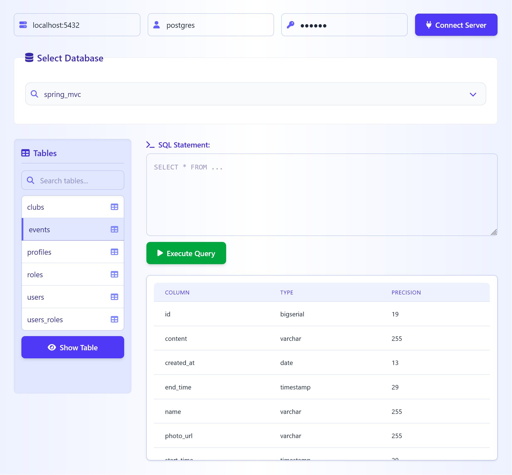

# SQL Tutor :desktop_computer:

A web-based PostgreSQL client for exploring databases, viewing table structures, and executing SQL queries in real-time.

## Features :sparkles:

-   **Database Explorer**: Browse databases/tables in hierarchical view
-   **Schema Inspection**: View table columns, indexes, and relationships
-   **Query Playground**: Execute SQL queries with syntax highlighting

## Tech Stack :gear:

**Frontend**:

-   Thymeleaf templates
-   HTMX for dynamic content
-   Tailwind CSS for styling

**Backend**:

-   Spring Framework
-   PostgreSQL JDBC Driver
-   Embedded Jetty Server

## Project Execution

This project uses a Taskfile to manage development workflows. You'll need to have the following installed:

-   [Task](https://taskfile.dev/) (task runner)
-   Java (for Maven/Jetty)
-   Node.js (for Tailwind CSS processing)
-   Maven (build tool)

to run the app in dev mode (live reload) run the following commands:`npm install` then `task serve`

to run without live reload run `mvn jetty:run-war`

the application will be available at: http://localhost:8080/
